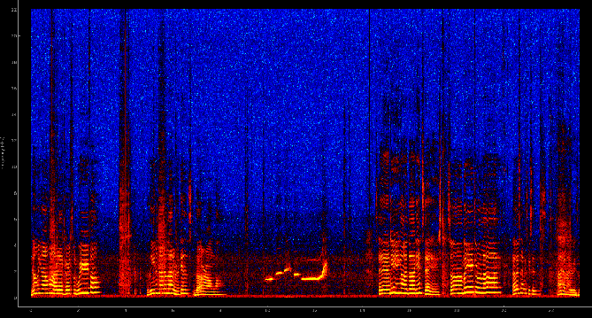

PyQtgraph Spectrogram
=======================

I could not find an example for a live running spectrogram for my favorite plotting library, so I decided to write one.

The little script I put togther uses [PyQtGraph](http://www.pyqtgraph.org/) and [PyAudio](http://people.csail.mit.edu/hubert/pyaudio/). I had originally wrote it to work with calibrated speakers and microphone I have here in the lab, so that I could have intensity values in dB SPL, but I switched to PyAudio here that should run on most computers' default speakers.

I created a ``MicrophoneRecorder`` class that takes a Qt signal in the constructor, so that it may use this to pass the data to the ``SpectrogramWidget`` class to draw it. I did it this way because drawing must be done in the Qt main event loop, so it is a good idea to have our IO class emit a signal after collecting data. Since I am using QTimer, called from our main GUI thread, I could actually hook the timeout to a combined read and draw function and not use signals. However, I had originally wrote this to work with other hardware, which runs in its own thread. I also think this is a cleaner solution, separating the read and draw operations, so I have kept it this way in the example.

 
import numpy as np
import pyqtgraph as pg
import pyaudio
from PyQt4 import QtCore, QtGui

FS = 44100 #Hz
CHUNKSZ = 1024 #samples

class MicrophoneRecorder():
    def __init__(self, signal):
        self.signal = signal
        self.p = pyaudio.PyAudio()
        self.stream = self.p.open(format=pyaudio.paInt16,
                            channels=1,
                            rate=FS,
                            input=True,
                            frames_per_buffer=CHUNKSZ)

    def read(self):
        data = self.stream.read(CHUNKSZ)
        y = np.fromstring(data, 'int16')
        self.signal.emit(y)

    def close(self):
        self.stream.stop_stream()
        self.stream.close()
        self.p.terminate()

class SpectrogramWidget(pg.PlotWidget):
    read_collected = QtCore.pyqtSignal(np.ndarray)
    def __init__(self):
        super(SpectrogramWidget, self).__init__()

        self.img = pg.ImageItem()
        self.addItem(self.img)

        self.img_array = np.zeros((1000, CHUNKSZ/2+1))

        # bipolar colormap
        pos = np.array([0., 1., 0.5, 0.25, 0.75])
        color = np.array([[0,255,255,255], [255,255,0,255], [0,0,0,255], (0, 0, 255, 255), (255, 0, 0, 255)], dtype=np.ubyte)
        cmap = pg.ColorMap(pos, color)
        lut = cmap.getLookupTable(0.0, 1.0, 256)

        self.img.setLookupTable(lut)
        self.img.setLevels([-50,40])

        freq = np.arange((CHUNKSZ/2)+1)/(float(CHUNKSZ)/FS)
        yscale = 1.0/(self.img_array.shape[1]/freq[-1])
        self.img.scale((1./FS)*CHUNKSZ, yscale)

        self.setLabel('left', 'Frequency', units='Hz')

        self.win = np.hanning(CHUNKSZ)
        self.show()

    def update(self, chunk):
        # normalized, windowed frequencies in data chunk
        spec = np.fft.rfft(chunk*self.win) / CHUNKSZ
        # get magnitude 
        psd = abs(spec)
        # convert to dB scale
        psd = 20 * np.log10(psd)

        # roll down one and replace leading edge with new data
        self.img_array = np.roll(self.img_array, -1, 0)
        self.img_array[-1:] = psd

        self.img.setImage(self.img_array, autoLevels=False)

if __name__ == '__main__':
    app = QtGui.QApplication([])
    w = SpectrogramWidget()
    w.read_collected.connect(w.update)

    mic = MicrophoneRecorder(w.read_collected)

    # time (seconds) between reads
    interval = FS/CHUNKSZ
    t = QtCore.QTimer()
    t.timeout.connect(mic.read)
    t.start(1000/interval) #QTimer takes ms

    app.exec_()
    mic.close()
 

To get the colormap, I copied values I found in the PyQtGraph source for [``GradientEditorItem``](https://github.com/pyqtgraph/pyqtgraph/blob/develop/pyqtgraph/graphicsItems/GradientEditorItem.py); these are the gradients you see when using ``ImageView``. To set the levels I ran the code and printed out the max and min of the psd array, and set ``ImageItem.setLevels`` manually to approximately what I saw.

This isn't exactly ready to be used in any scientific analysis, but I think its pretty neat what you can do with such little code. I also have the code posted in a [gist](https://gist.github.com/boylea/1a0b5442171f9afbf372).

###Bonus! Science!

If you run this yourself, take the opportunity to notice the different characteristics of different sounds. Talk (or sing!) to yourself a little bit, and then try vowels on their own ("a e i o u"). Then try some consonents on their own ("sh ch t ck f"), and notice how different the frequency spectrum is. The consonents have more energy in the higher frequencies.  This is why high frequency [hearing loss](http://www.npr.org/blogs/health/2013/04/06/175945670/the-real-sounds-of-hearing-loss) (such as associated with age) makes it hard to distinguish between consonents, and thus harder to understand another's speech.

Also, whistle and notice the lack of harmonics that are present in speech. This is because speech is produced by [vocal fold](http://en.m.wikipedia.org/wiki/Vocal_folds#Function) vibrations (a.k.a. vocal cords), and a whitsle is a pure tone that is emitted just by pushing air through the unmoving aperture of your lips (or other device of choice).

<!-- http://www.ncbi.nlm.nih.gov/pmc/articles/PMC2787079/ -->

<!-- http://scitation.aip.org/content/asa/journal/jasa/111/1/10.1121/1.1427357 -->