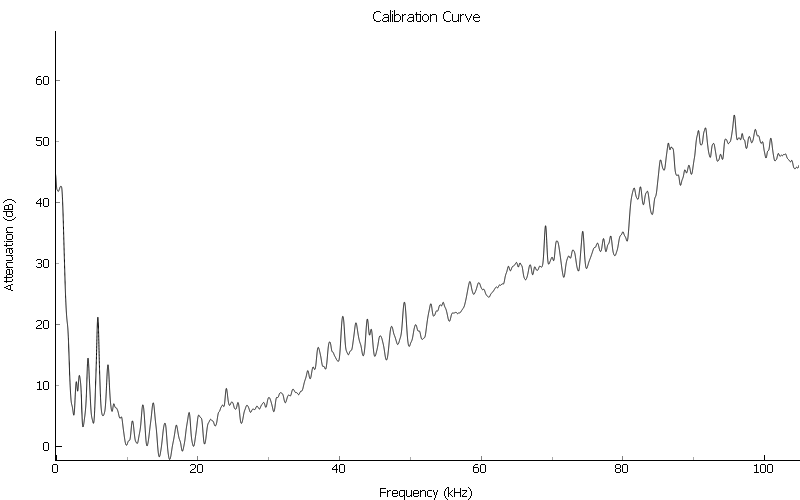
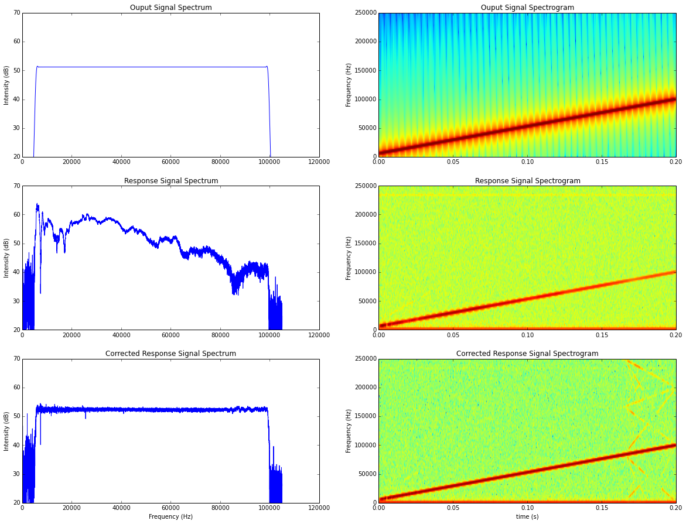

Ultrasonic Speaker Calibration Adventure, Part 1
=================================================
For my employ, I have been charged with the task of developing a new data
acquisition system for the electrophyisiology set-up in the lab. We are an
auditory neuroscience lab, thus, we have a need to present sound stimuli and
measure the brain response. An important feature for the new system was to be
able to calibrate it to present the sounds more accurately than the old system.
The following in an overview of my journey into digital signal processing. I
honestly didn't even know what DSP was when I started, and thus had a gross
under-estimate of how long it would take me to complete this quest. However old
and tired I may be now, I have arrived at my destination, and am, at least, a
little wiser.

**Background**:

An inherent [characteristic][fresp] of audio speakers is that all frequencies
that are played through the speakers do not come out at equal intensities for
the same power delivered to the speakers. What the shape of this frequency vs.
intensity curve looks like, will depend on the type of speakers being employed.
Our lab deals with high frequency stimuli, and thus we use tweeters, which are
meant for use in higher frequency output. This is opposed to mid-range or
woofers -- which are what you have encountered when that guy rolls up at a stop
light and is emitting bass that detaches your organs from their fascia. Often
accompanied with an impeccable taste in music.

Ultrasonic frequencies(>20kHz) are greatly attenuated, as compared to human
hearing range (20Hz-20kHz). Since we are studing the audiory system of organisms
that can hear in this range (e.g. mice, bats), it is important to know how this
speaker frequency roll-off may be affecting the sound stimuli we use for
experiments, and, if possible, compensate for it. If we generate a series of
pure tones (single frequency sounds) at the same amplitude, and play them out of
a speaker, the resultant intensity as measured through a decibel meter may look
like this:

This means that if we have a stimulus with many frequency components (e.g.
animal vocalizations), parts of the stimulus will be attenuated more than
others. The implication is that we could lose some frequency components of the
sound, and not others, to below a hearing threshold. We want to do our best to
recreate a stimulus as close to a native (non-recording) sound as possible.

[fresp]: http://www.ecoustics.com/articles/understanding-speaker-frequency-response/

The Way It Is
-------------

Currenly in the lab, such a series of tones is generated, and manually written
down, with quill and parchment, for each tone using the dB meter reading. This
is later taken into account when doing data analysis.

From this starting point, I went to automate the process. I wrote a program that
would loop through a series of tones, and record their amplitude through a
microphone. I used a dB meter to manually measure the dB SPL of a single
reference frequency and set this as 0 attenuation.

I used the peak voltage (RMS) of the time domain signal recieved from the
microphone to determine the intensity. The dB attenuation was calculated
relative to the amplitude of the reference frequency. In series of our output
signal, is a signal attenuator, which will reduce the signal intensity by a
specified dB amount. So, I can then run the same series of tones, only using the
results from the roll-off curve to attenuate each tone according to the inverse
of the result for that frequency. This does work for pure tones.

**What about the frequencies we did not explicitly measure with a tone? What
about stimuli with multiple frequency components?**

A partial solution to this, is to use as small of a frequency step in the tone
series as we have patience for, and interpolate for all the others. This works,
but still if we are presenting only pure tones.

Harder, Better, Faster, Stronger
---------------------------------

What I needed to do was to break down the stimuli into their frequency
components and compensate in the frequency domain.

That mathmatical operation used to convert a signal from a series of time
samples to a list of frequency coefficients of its component sinusoids, is the
Discrete Fourier Transform (DFT). The DFT, however has O(N2)
complexity &#9785;. Luckily, some [clever people][cooley] came up with the Fast
Fourier Transform (FFT), which is an alogrithm that can effectively compute the
DFT in O(NLogN) time.

[cooley]: https://en.wikipedia.org/wiki/Cooley%E2%80%93Tukey_FFT_algorithm

I can discover a frequency attenuation curve by generating a stimulus which
contains energy at all frequencies with constant power spectral density, e.g.
white noise or a frequency sweep (aka chirp). By comparing the FFT of the output
signal and its recorded response, I can get the attenuation curve of the speaker
with much better frequency resolution, and in much less time. Win.

The following function calculates a dB frequency attenuation vector for a given
desired output signal, and it's recorded response:

 
    import numpy as np
    
    def attenuation_curve(signal, resp, fs, calf):
        """Calculate an attenuation roll-off curve, from a signal and its recording
    
        signal : The output signal to the speakers
        resp : Recorded response for signal
        fs : Sample rate of input and output signals (should be the same)
        calf : Frequency for which to use as 0 attenuation
    
        returns : attenuation values, frequencies
        """
        # remove dc offset
        resp = resp - np.mean(resp)
    
        y = resp
        x = signal
    
        # convert time signals to frequency domain
        Y = np.fft.rfft(y)
        X = np.fft.rfft(x)
    
        # take the magnitude of signals
        Ymag = np.sqrt(Y.real**2 + Y.imag**2) # equivalent to abs(Y)
        Xmag = np.sqrt(X.real**2 + X.imag**2)
    
        # convert to decibel scale
        YmagdB = 20 * np.log10(Ymag)
        XmagdB = 20 * np.log10(Xmag)
    
        # now we can substract to get attenuation curve
        diffdB = XmagdB - YmagdB
                        
        # frequencies present in calibration spectrum
        npts = len(y)
        fq = np.arange(npts/2+1)/(float(npts)/fs)
    
        # shift by the given calibration frequency to align attenutation
        # with reference point set by user
        diffdB -= diffdB[fq == calf]
    
        return diffdB, fq
 

This gets me to where I was before, albeit with a better resolution of
attenuation curve. However, now we have figured out that we can use Fouier
analysis to get at the composite frequencies in signals. So, we can use the
attenuation vector to adjust the relative frequency intensities in the output
signal by the appropriate amount, for it to come out of the speaker with the
intended frequency spectrum. Explicitly, that is, convert the output signal into
the frequency domain, multiply it by the attenuation vector, and convert back
into the time domain.

Here is a simple function that will do this:

 
    def multiply_frequencies(signal, fs, attendB):
        """Adjust output signal with sample rate fs, according to calibration curve attendB
    
        returns calibrated signal
        """
        npts = len(signal)
        
        # convert signal from time to frequency domain
        X = np.fft.rfft(signal)
         
        fq = np.arange(npts/2+1)/(float(npts)/fs)
        
        # convert from dB to signal amplitude
        H = 10**((attendB).astype(float)/20)
        
        # scale the output signal
        Xadjusted = X*H
        
        # convert back to the time domain
        signal_calibrated = np.fft.irfft(Xadjusted)
    
        return signal_calibrated
 

This little function has a few short falls, however.

As a matter of practicality, I want to restrict the calibration to a range for
which I care about, 5 - 100kHz. This way we do not try to boost frequencies
which are out of range of our speakers altogether, or end up with a stimulus
that has a prohibitively large amplitude as it tries to adjust high frequencies
for which the intensity roll-off is very high. So, we should only apply the
frequency adjustment for the frequency range of interest.

Smoothing my attenuation vector before I multiply it against my output signal
reduces noise we captured during the calibration recording, and also has the
benefit of smoothing out the edges of our frequency application range. You can
find example code for the `smooth` function in the [scipy
cookbook](http://wiki.scipy.org/Cookbook/SignalSmooth). I experimented with
values and window types to find what got me the best results.

I also want to create a more general solution, so I want to be able to output
signals with different samplerates using the same attenuation vector. To do
this, I take as input the calibration frequencies and the output signal
samplerate, and interpolate to get the calibration attenuation vector into the
correct frequency steps.

Thus, the previous function becomes:

 
    from scipy import interpolate
    from spikeylab.tools.audiotools import smooth
    
    def multiply_frequencies(signal, fs, calibration_frequencies, attendB, frange):
        """Adjust output signal with sample rate fs, according to calibration curve attendB, with frequencies calibration_frequencies.
        Restrict calibrated frequencies to frange (low, high)
    
        returns calibrated signal
        """
        npts = len(signal)
        
        # convert signal from time to frequency domain
        X = np.fft.rfft(signal)
    
        # get the indexes of the end points of the frequency range
        f = np.arange(len(X))/(float(npts)/fs)
        fidx_low = (np.abs(f-frange[0])).argmin()
        fidx_high = (np.abs(f-frange[1])).argmin()
        
        # get only those frequencies for which we want to adjust the output signal by
        roi = f[fidx_low:fidx_high]
        
        # interpolate frequencies to match input signal
        cal_func = interpolate.interp1d(calibration_frequencies, attendB)
        Hroi = cal_func(roi) # interploate on region of interest
        
        # place into a vector of the correct length, with zeros for the frequencies we don't want to affect
        H = np.zeros((len(X),)) 
        H[fidx_low:fidx_high] = Hroi
        
        # add smoothing to reduce noise and soften edges
        H = smooth(H)
        
        # convert from dB to signal amplitude
        H = 10**((H).astype(float)/20)
    
        # scale the output signal
        Xadjusted = X*H
    
        # convert back to the time domain
        signal_calibrated = np.fft.irfft(Xadjusted)
        
        return signal_calibrated
 
    

Now to bring it all together.

To test this, I can do some before and after calibration signals and compare
their responses. I think a chirp is most interesting to look at. I also just
like to say "chirp". Chirp. To keep it simple, I have used the same chirp signal
for calibration recording and the adjustment test, though this is not necessary.

 
    from scipy import signal
    import matplotlib.pyplot as plt
    from test.scripts.util import play_record
    
    out_voltage = 0.65 # amplitude of signal I want to generate
    mphone_sens = 0.00407 # mV/Pa calibrated micrphone sensitivity (for plotting results)
    
    fs = 5e5
    duration = 0.2 #seconds
    npts = duration*fs
    t = np.arange(npts).astype(float)/fs
    out_signal = signal.chirp(t, f0=5000, f1=100000, t1=duration)
    # scale to desired output voltage
    out_signal = out_signal*out_voltage
    
    # windowing (taper) to avoid clicks
    rf_npts = 0.002 * fs
    wnd = signal.hann(rf_npts*2) # cosine taper
    out_signal[:rf_npts] = out_signal[:rf_npts] * wnd[:rf_npts]
    out_signal[-rf_npts:] = out_signal[-rf_npts:] * wnd[rf_npts:]
    
    # play signal and record response -- hardware dependent
    response_signal = play_record(out_signal, fs)
    
    # we can use this signal, instead of white noise, to generate calibration vector (range limited to chirp sweep frequencies)
    attendb, freqs = attenuation_curve(out_signal, response_signal, fs, calf=15000)
    calibrated_signal = multiply_frequencies(out_signal, fs, freqs, attendb, frange=(5000,100000))
    
    calibrated_response_signal = play_record(calibrated_signal, fs);
    
    ###########################PLOT######################################
    # now let's take a look at the frequency responses of our signals
    # convert time domain signals into magnitude of frequency domain with dB scale
    spectrum_desired = 20 * np.log10(abs(np.fft.rfft(out_signal))/out_voltage)
    spectrum_response = 20 * np.log10(abs(np.fft.rfft(response_signal))/mphone_sens)
    spectrum_calibrated_response = 20 * np.log10(abs(np.fft.rfft(calibrated_response_signal))/mphone_sens)
    spectrum_response[0] = 0;
    spectrum_calibrated_response[0] = 0;
    
    idx = 21000 # focus on the frequency range we want
    
    plt.figure(figsize=(20,15))
    gs = plt.GridSpec(3,2)
    
    plt.subplot(gs[0,0])
    plt.plot(freqs[1:idx], spectrum_desired[1:idx])
    plt.title("Ouput Signal Spectrum")
    plt.ylabel("Intensity (dB)")
    plt.ylim((20, 70))
    plt.subplot(gs[0,1])
    plt.specgram(out_signal, Fs=fs);
    plt.title("Ouput Signal Spectrogram")
    plt.ylabel("Frequency (Hz)")
    
    plt.subplot(gs[1,0])
    plt.plot(freqs[1:idx], spectrum_response[1:idx])
    plt.title("Response Signal Spectrum")
    plt.ylabel("Intensity (dB)")
    plt.ylim((20, 70))
    plt.subplot(gs[1,1])
    plt.specgram(response_signal, Fs=fs);
    plt.title("Response Signal Spectrogram")
    plt.ylabel("Frequency (Hz)")
    
    plt.subplot(gs[2,0])
    plt.plot(freqs[1:idx], spectrum_calibrated_response[1:idx])
    plt.ylabel("Intensity (dB)")
    plt.ylim((20, 70))
    plt.title("Corrected Response Signal Spectrum")
    plt.xlabel("Frequency (Hz)")
    plt.subplot(gs[2,1])
    plt.specgram(calibrated_response_signal, Fs=fs);
    plt.title("Corrected Response Signal Spectrogram")
    plt.xlabel("time (s)")
    plt.ylabel("Frequency (Hz)");
 

Definite improvement. The extra energy visible in the last plot is due to
[harmonics and aliasing](http://www.dspguide.com/ch11/5.htm). My sampling rate
is more than adequate for the stimuli which I need to present, so it's not
something to worry about.

Moving On
---------

The biggest downside to this method, is that it is computationally expensive. My
application needs to prepare several hundred unqiue stimuli before presenting
them. In the middle of an experiment, time lost is data lost. Of course, when I
am rapidly changing and testing a piece of code I use a small example set of
data. When I went to show this to a lab member ("Hey look what I can do!") they
arranged a set of data more like what they would use in an actual experiment.
The look on the scientist's face as the program takes 5 minutes to calibrate a
few hundred short stimuli told me "unimpressed". So I had to do something
different, which lead me further into the depths of DSP...

To be continued.

Wow, if you made this far, you deserve a cookie! The delicious kind, not the I'm
-watching-you kind.

Note: A resource that I found useful for understanding the concepts here (and
the next section especially) was Steven W. Smith's free online book [The
Scientist and Engineer's Guide to
Digital Signal Processing](http://www.dspguide.com/pdfbook.htm). Also Thanks to
Kinga for helping me figure out the math.
