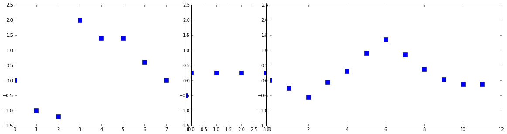
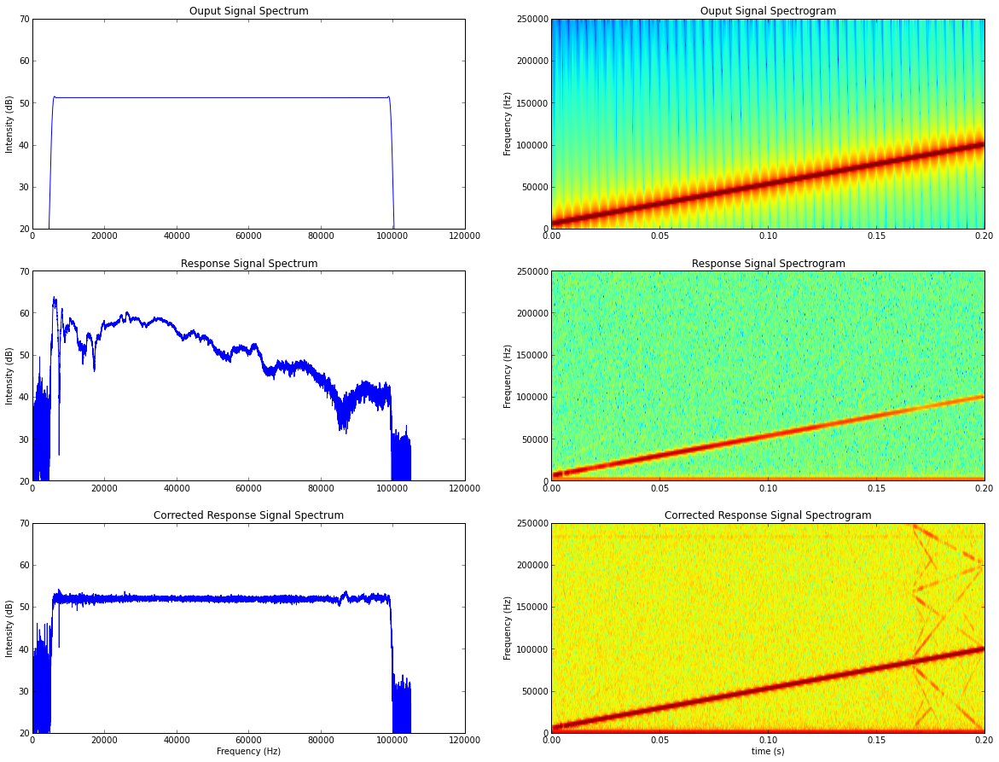
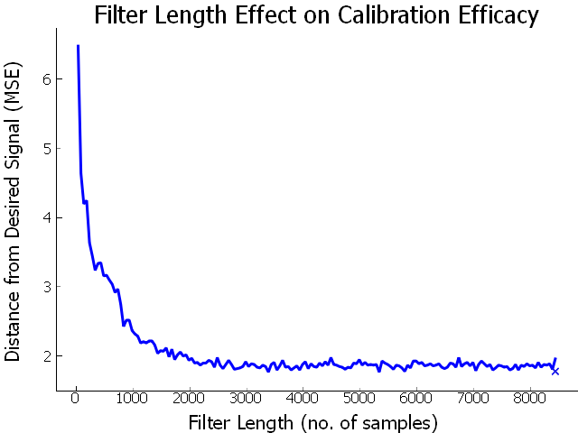
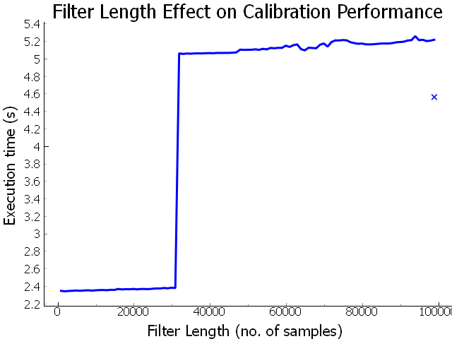

Ultrasonic Speaker Calibration Adventure, Part 2
=================================================

So I had a solution that got the ouput I wanted but it was just too slow. I ran
some profiling on my code (using [cProfile](https://docs.python.org/2/library/profile.html#module-cProfile) and [RunSnakeRun](http://www.vrplumber.com/programming/runsnakerun/)) and found that most of my time was being spent in my
frequency adjustment function, of course. I am processing many stimuli in a
batch, but the calculations are independent -- perfect candidate for
multiprocessing, I thought. So I wrote a little code to spin off a bunch of
processes, and my code executed faster... sometimes. Depending on the type of
signal I was calibrating, the increase in performance was somewhere between
1-10x. As it turns out, I should be fixing my shitty, slow algorithm, instead of trying to squeeze better performance out of it.

Hmm, so what was the difference between my stimuli that had startling performance differences? It was taking ~5 seconds to calibrate 200 tone stimuli, and ~5 minutes to calibrate 200 stimuli from a recording file of the same duration. As input to the calibration functions, both types are just represented by a vector of numbers. 

Although they were the same duration, what I had overlooked was
sampling rate. The sythnthesized stimuli had a constant samplerate that I set,
but the recording files use the samplerate that they were recorded at, which was
different. Thus, the length of the vector that gets input into the FFT function
was a different length, and very inefficient in some cases.

The answer was to institute zero-padding. Any
[text](http://www.sp4comm.org/webversion/livre.html#x1-630004.7.2) on the FFT
will mention that it is more efficient for input with a length of 2n,
and this experience very much illustrated this for me. Here is what I replaced
the beginning of my `multiply_frequencies` code with:

 
def multiply_frequencies(signal, fs, attendB):
    npts = len(signal)
    padto = 1<<(npts-1).bit_length() # next highest power-of-2

    X = np.fft.rfft(signal, n=padto)
    ...


Ahhh Much better, now all my execution times are on the scale of seconds, instead of
minutes. However, now having brought DSP into my conversational discourse,
people were throwing out terms like "convolve" and "FIR", and I had a feeling
that a better solution was waiting for me in these mysterious words. So, after
some more reading, I looked into creating a filter out of my frequency
attenuation curve.

Creating a Digital Filter
--------------------------
To understand how to do this I must first explain some DSP concepts.

### Some Fundamentals

First I want to define the delta function, also known as the unit impulse, which is a signal with a single non-zero point of value one at time zero. An impulse response is the ouput of a system, where the input is the unit impulse.

Any digital signal can be decomposed into a group of impulses, or shifted and
scaled delta functions. Add this group of impulses back together and you receive your original signal.

A necessary condition is that we are working with a [linear time-invarient
system](http://www.sp4comm.org/webversion/livre.html#x1-740005.1).  This means that if an input to the system is shifted and/or scaled, that the output of the system would also be shifted/scaled by the same amount.
The important result from the property of linear time-invarience, is that its
impulse response contains all the necessary information about a system.  If you
know a system's impulse response, you immediately know how it will react to any
impulse. So, if we know the response to an impulse, and we know that the signal
is just a collection of impulses, we can shift and scale the impulse response
according to the points of our input function and add together the results to
get the total response for our input function.

This sounds great, but you may be wondering "Ok, how do I DO that?", to answer
that we must introduce a mathmatical operator you may or may not be familiar
with, called convolution. It was new to me, so I am going to explain it.

Convolution is represented by the $$\ast$$ symbol in math notation (not to be
confused with multiplication in code). In it's discrete form, it takes two
signals and produces a third signal as output. The length of the ouput signal
will be the addition of the length of the two input signals minus one. There are two ways to think about and implement convolution.

The first way, the input side algorithm, involves analyzing how each sample of
the input signal contributes to many points in the output signal. For each point
in the (first) input signal you multiply it by each point in the second signal
and add up all the results in place. For me, it helps to see this in code:

 
def convolve_input(a,b):
    output = np.zeros((len(a)+len(b)-1,))
    for i in range(len(a)):
        for j in range(len(b)):
            output[i+j] = output[i+j] + ( a[i] * b[j] )
    return output

x = [0, -1, -1.2, 2, 1.4, 1.4, 0.6, 0, -0.5]
# h = [1, -0.5, -0.2, -0.1]
h = [0.25, 0.25, 0.25, 0.25]

y0 = convolve_input(x, h)

#####plot results#######
col0 = len(x)
col1 = len(x) + len(h)
colspan = len(x) + len(h) + len(y0)
plt.figure(figsize=(20,5))
gs = plt.GridSpec(1,colspan)
plt.subplot(gs[0,:col0])
plt.plot(x, 's', ms=10)
plt.ylim(-1.5, 2.5)
plt.subplot(gs[0,col0:col1])
plt.plot(h, 's', ms=10)
plt.ylim(-1.5, 2.5)
plt.subplot(gs[0,col1:])
plt.plot(y0, 's', ms=10)
plt.ylim(-1.5, 2.5)


The second way, the output side algorithm, looks at how each sample in the ouput
receives information from the many points in the input signal. This is the more
standard way to define convolution, and in its discrete and finite form, it is
represented by the equation:

$$(f \ast g)[n] = \sum_{m=0}^{M}(f[n-m]g[m])$$

 
def convolve_output(a,b):
    output = np.zeros((len(a)+len(b)-1,))
    for i in range(len(output)):
        for j in range(len(b)):
            if i-j < 0:
                continue
            if i-j >= len(a):
                continue
            output[i] = output[i] + a[i-j] * b[j]
    return output


Here we are looping over every ouput point, and adding up all points in the
input that multiply together at that point. If you were to run through the
example data, you would get identical results to the first method.

When we are dealing with signals and filters, the filter signal is typically
much shorter than the data signal. For a filter signal of length M, note that
the first and last M-1 samples of the ouput signal are trying to receive input
from non-existent samples from the input signal. When this happens we say that
the impulse response is not fully immersed in the input signal. These samples of
the output are effectively garbage, and will we toss them out when we use this
later.

In the example data I gave, the second signal is acting as a moving average
filter. You can see that the output signal is a smoothed version of the first
input signal. This is the case whenever one of our input signals has identical
points of value 1/length of the signal.

The moral of this convoluted story (hehe) is that you take in two signals and
produce a third from them. It is commutative, so it doesn't matter which input
signal is which, but for the purposes of our filter, we can think of one of the
input signals as the input to the system and the other input signal as
performing some shifting and scaling.

Hopefully this is at least somewhat clear, not looking for crystal, I'll settle
for murky water. Check out a more in depth explainantion [here](http://www.dspguide.com/ch6.htm).

###Back to our Filter

Since we know that the impulse response contains all information about a system,
we can use the DFT on the impluse response to get the frequency response of the
system, since the DFT converts time domain information into frequency domain
information. Therefore, it follows that we can get the impulse reponse by taking
the IDFT of the frequency response (which we already have, see the [prequel]()).
Thus, we can determine the impulse response, and convolve this with our stimuli
signals, to receive our calibrated output.

Since the impulse response, in theory, is infinite, and we need to deal with
finite signals, as a matter of practicality we can truncate the impluse response
to a length that will still produce the frequency response we want, to within an
acceptable accuracy.
This is what I get when I estimate the impulse response from the IFFT of the
frequency response.

An important step in between performing the IFFT and truncating it is to rotate
the vector to create a [causal](http://www.dspguide.com/ch7/1.htm) filter

 
from spikeylab.tools.audiotools import tukey

def impulse_response(genrate, fresponse, frequencies, frange, filter_len=2**14):
    """
    Calculate filter kernel from attenuation vector.
    Attenuation vector should represent magnitude frequency response of system
    
    Args:
        genrate (int): The generation samplerate at which the test signal was played
        fresponse (numpy.ndarray): Frequency response of the system in dB, i.e. relative attenuations of frequencies
        frequencies (numpy.ndarray): corresponding frequencies for the fresponse
        frange ((int, int)) : the min and max frequencies for which the filter kernel will affect
        filter_len (int, optional): the desired length for the resultant impulse response
        
    Returns:
        numpy.ndarray : the impulse response
    """

    freq = frequencies
    max_freq = genrate/2+1

    attenuations = np.zeros_like(fresponse)
    # add extra points for windowing
    winsz = 0.05 # percent
    lowf = max(0, frange[0] - (frange[1] - frange[0])*winsz)
    highf = min(frequencies[-1], frange[1] + (frange[1] - frange[0])*winsz)

    # narrow to affect our desired frequency range
    f0 = (np.abs(freq-lowf)).argmin()
    f1 = (np.abs(freq-highf)).argmin()
    fmax = (np.abs(freq-max_freq)).argmin()
    # also window section
    attenuations[f0:f1] = fresponse[f0:f1]*tukey(len(fresponse[f0:f1]), winsz)

    freq_response = 10**((attenuations).astype(float)/20)
    
    # can only filter for between 0 and Nyquist
    freq_response = freq_response[:fmax]

    impulse_response = np.fft.irfft(freq_response)
    
    # rotate to create causal filter
    impulse_response = np.roll(impulse_response, len(impulse_response)//2)

    # truncate
    if filter_len > len(impulse_response):
        filter_len = len(impulse_response)
    startidx = (len(impulse_response)//2)-(filter_len//2)
    stopidx = (len(impulse_response)//2)+(filter_len//2)
    impulse_response = impulse_response[startidx:stopidx]
    
    # Also window the impulse response
    impulse_response = impulse_response * tukey(len(impulse_response), 0.05)

    return impulse_response

    

It should be possible to reduce the size of the attenuation vector to improve
performance, as I would then have a shorter vector to convolve with my signal.
Zero values at the ends of the filter do not add anything to the convolution, so
they can be safely truncated, however, it was worth playing around with lengths,
as some very small values close to zero can have a significant effect on the
filter. More about this later.

Now that we have a filter kernel for our system, I can convolve this with my
outgoing signal to get a calibrated signal. Here is a script which brings it
all together. Note that this is almost identical to the demo script from the
previous post, except where noted:

 
from scipy import signal
import matplotlib.pyplot as plt
from test.scripts.util import play_record
from spikeylab.tools.audiotools import attenuation_curve # defined in previous post

out_voltage = 0.65 # amplitude of signal I want to generate
mphone_sens = 0.00407 # mV/Pa calibrated micrphone sensitivity (for plotting results)

fs = 5e5
duration = 0.2 #seconds
npts = duration*fs
t = np.arange(npts).astype(float)/fs
out_signal = signal.chirp(t, f0=5000, f1=100000, t1=duration)
# scale to desired output voltage
out_signal = out_signal*out_voltage

# windowing (taper) to avoid clicks
rf_npts = 0.002 * fs
wnd = signal.hann(rf_npts*2) # cosine taper
out_signal[:rf_npts] = out_signal[:rf_npts] * wnd[:rf_npts]
out_signal[-rf_npts:] = out_signal[-rf_npts:] * wnd[rf_npts:]

# play signal and record response -- hardware dependent
response_signal = play_record(out_signal, fs)

# we can use this signal, instead of white noise, 
# to generate calibration vector (range limited to chirp sweep frequencies)
attendb, freqs = attenuation_curve(out_signal, response_signal, fs, calf=15000)

# -----difference from previous post -------
filter_kernel = impulse_response(fs, attendb, freqs, frange=(5000,100000))
calibrated_signal = signal.fftconvolve(out_signal, filter_kernel) #faster convolution function
# remove those 'garbage' points
calibrated_signal = calibrated_signal[len(filter_kernel)/2:len(calibrated_signal)-len(filter_kernel)/2 + 1]
# ------------------------------------------

calibrated_response_signal = play_record(calibrated_signal, fs);

###########################PLOT######################################
# see previous post for plotting code 


So this looks like it's working. I still need a measure of how "good" the
calibration is. After all, this is science, so "this one *looks* better than
that one", isn't really a sufficient measure. I calculated the error between my
desired and recorded response using the mean square error: $MSE = \frac{1}{n}
\sum_{n=0}^{n}(\hat{Y_i} - Y_i)^2$. In the data plot below, I added an x to
indicate the measure for the multiplication method from the last post. As you
can see, the filter kernel just needs to be a minimum size, > 2400, to get the
best results.

I also calculated the MSE of an uncalibrated signal, which came in at 46.63,
which means that our calibrated signals produce a much more accurate sound. This
data was generated using a chirp stimulus with a duration of 200ms and a
samplerate of 500kHz, although other stimuli were examined, to comparable
results.

Now, I need to determine if this method *is* actually faster than before. I ran
the calibration using different kernel lengths, and also using the
multiplication method from before. Each data point represents the time taken to
execute 200 iterations of applying the filter to a sample signal:

Thus, using a digital filter, we can be about twice as fast as our previous
method of multiplying frequencies. However, there is that sharp jump where the
execution time doubles, between 214 and 215. Drilling
down, I found this to be exactly between a filter length of 31073 and 31074
(although yesterday it was between 24289 and 24290 :/ ). This was regarless of
the signal length it was convolved with. I made sure to include filters lengths
that are a power of 2, since I  was employing numpy's `fftconvolve`, and signal
length could be a performance factor. I also padded the signal I am convolving
with to be a power of two, but that seemed to be worse, with smaller filters
jumping up to the slower time. I do not understand why this is. If you think you
know why, please leave a comment!

Luckily, we know from the efficacy evaluation that we can use a shorter filter.
So, I can use a filter with a size of 2400 - 24289 and achieve good results with
respect to frequency response and performance.

Now I have a calibration procedure that produces a signal much closer to the
desired sound, and in a resonable amount of time. What this all means, is that I
can now go get in my hammock and take a nap.

<ul style="padding:0">
The resources that I found most useful, and linked to, in this post were:
<li style="margin-left:3em"><a href="http://www.sp4comm.org/webversion/livre.html">Signal Processing for Communications</a>, whose authors also offer a free online <a href="https://www.coursera.org/course/dsp">class</a> through Coursera</li>
<li style="margin-left:3em"><a href="http://www.dspguide.com/pdfbook.htm">The Scientist and Engineer's Guide to Digital Signal Processing</a>, which has been invaluable in putting concepts into words that a non-math major can understand.</li>
</ul>

    
