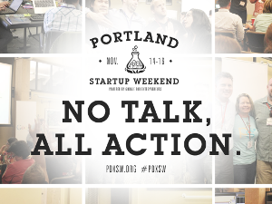
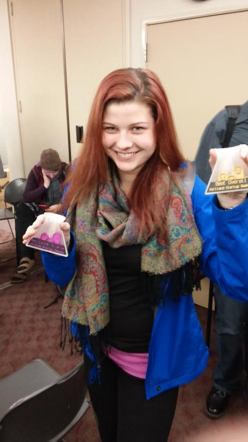

---
layout: default
short: My experience of PDXSW in listicle form
comments: True
--- 

9 Lessons I Learned at Startup Weekend
======================================
  

[Startup weekend](http://startupweekend.org/about/) is an event where people who have never met have large enough egos to think they can create a product, and launch a startup over a weekend. I attended one in Portland in November, where I joined a team with an idea pitched by [Matthew Fountain](http://matthewfountain.com/), who volunteers with homeless youth. Thus, we created [an app](www.pdxshelter.org) that would provide real-time bed availabilities at shelters. It was an intense, enriching experience, and my team even won the event. Here are some of my take-aways from the weekend.

1 - Forcing myself into an uncomfortable situation can be a good thing
--------------------------------------------------------------------
When I signed up for startup weekend, I was not entirely sure it was a good idea for me. I got into it because a smart and successful friend of mine sent around an email asking if anyone else wanted to go, so I decided to give it a shot.

My apprehension going in was due to a fear that I would find myself useless among the team I joined. I am confident of my programming skills, but I have almost no web dev experience. (what you see on this blog is basically it, folks.) I figured everyone would not be pitching ideas for desktop apps. I am, at least, relatively good at forcing myself into uncomfortable situations, if not so good at figuring out what to do with myself once there. I figured the only way to get better at that is by doing. So there I was, and I definitely learned a lot.

2 - Programming skills are transferable between languages
------------------------------------------------------
Of the 8 people on the team, there was only one person with any web development experience. However, without any prior JavaScript experience, I was able to help debug the code, and then dive into writing some myself. Having several programming languages under my belt, picking up a new one and producing working code is do-able in a weekend. 

The other dev, [Guy](https://www.linkedin.com/in/ghalperin), showed up on Saturday morning (having stayed up late at home on Friday) with some working code that integrated the use of Google maps API and [Firebase](https://www.firebase.com/) (Firebase is cool). This served as a great starting point, and really the backbone of our MVP(Minimum Viable Product). 

So I forked the Github repo he created and began to figure out how to add geolocation, at the same time learning JavaScript and getting acquainted with the code he had already written. So this simple task took me a little while, but before lunch I had some code to push.

3 - Working with other developers is fun
---------------------------------------------
I love my job now, but probably the biggest downside is that I work alone, there are no other developers. On Saturday, we pair-programmed the app, working through features and bugs. I really enjoyed getting to work closely with another person on code, and talk our way through together what we were trying to do. I was expecting the weekend to be more frustrating and stressful than fun, and it turned out to be the other way around. (Although, I did observe this was not the case for other teams)

4 - JavaScript is a bit ridiculous
-------------------------------
Globals by default? That makes me nervous. And I'm just going to avoid anything to do with type checking. To get myself acquainted with JS, I did find this delightful post on [JavaScript for C and python programmers](http://www.wooji-juice.com/blog/javascript-article.html). 

5 - Code I write on little sleep is not elegant
----------------------------------------------
The point of startup weekend is not to produce beautiful code, it's to get an MVP (Minimum Viable Product). That is what we did. Guy and I stayed until forced out by the venue staff on Saturday, divvying up tasks to go home and complete before the next day. I was adding events to the DB and map, and Guy was to make everything work in mobile. Fuelled by excitement and coffee, we were up until 4.30am finishing our pieces. Later, looking at the code I wrote, there was some slightly cringe-worthy stuff in there, such as this little gem:

 
    var showShelters = 1

    function toggleShelters(){
      showShelters = !showShelters
      if (showShelters){
        sheltersFirebaseRef.on('value', function(dataSnapshot){
          dataSnapshot.forEach(function(child){
            shelter = child.val()
            var marker = shelterMarkerObjects[shelter.name];
            marker.setVisible(true)
          })}) 
      }else{
        sheltersFirebaseRef.on('value', function(dataSnapshot){
          dataSnapshot.forEach(function(child){
            shelter = child.val()
            var marker = shelterMarkerObjects[shelter.name];
            marker.setVisible(false)
          })})
      }
    }


Inconsistent use of semicolons, recursive registering of events each time a toggle button gets pressed, and a fantastically repetitive 'If true then true else false' clause. Yep. I put that code on the internet for other people to see.

With a little more sleep, you can replace this with:

 
    function toggleShelters() {
      showShelters = !showShelters;
      for (name in shelterMarkerObjects) {
        shelterMarkerObjects[name].setVisible(showShelters);
      }
    }


6 - Designers are good
-------------------
We spent Sunday mostly making sure everything worked, and trying to make it look halfway decent. Unfortunately we didn't officially have a designer on the team, and thus we meandered our way through our site design and re-design. We went through several different looks before we settled on our demo version. We had our impromptu designer, [Thursday](http://www.thursdaybram.com/), redesign the icons we wanted to use for the site about 11 times. Sorry Thursday.

I am happy with what we were able to quickly put together with the resources that we had available at the time. However, moving forward I know we need a designer to optimise the layout of our site so that users can find what they need efficiently. Also, from an aesthetic point of view I know that having a good looking site does establish some level of professionalism, and thus trust from the user as well.

7 - Sometimes you need to just need to let go of code
--------------------------------------------------
Late afternoon on Saturday, we ended up needing to throw out a lot of code partly because it wasn't working properly, but mostly because we had changed how we wanted to users to interact with the app. When you are in such a time-crunch you have to let go of the valuable time wasted on that code, and get over it fast. By the end of the day on Saturday we were most of the way there with respect to functionality of the app.

8 - People with non-tech skills are necessary for the success for your tech product
--------------------------------------------------------------------------------
While us developers were busy writing code, other team members were making phone calls or went out into Portland and were gathering valuable information from shelters and homeless people about what they would find useful in an app. This was invaluable for us to create a relevant app, and, in fact, the team won an award specifically in customer validation. Our team leader Matthew gave the rough, but heartfelt, final pitch to the judges, in which we took home the prize for best overall as well.

9 - The Portland community rocks
-------------------------------
The response we have gotten from the community has been amazing, people from local organizations here in Portland that provide services to the homeless are working with us to help provide the most relevant and useful product/service. I did not understand before the extent of how many hard working people are doing impactful work locally.

We have decided to move forward past startup weekend as a team, and continue to develop on our app. As we talk to more people we are getting away from our original product, and I am excited for the future and building something that will help improve the quality of life for those in my community.

For more information on PDXShelter and if you are interested in getting involved check out our [webpage](https://www.pdxshelter.org/about.html).