Digital Signal Processing Fundamentals
=======================================

This post is meant to serve as an introduction to the core concepts of Digital Signal Processing (DSP). It should be accessible to anyone with a high-school level of math knowledge. I gave a talk on this subject at OSCON in July 2015 and this is the first part of that material in written form, with a few extras thrown in. This post will be followed by the material from the rest of the talk, in future posts.

Let's start all the way at the beginning

What is DSP?
-------------

Digital Signal Processing, hereon referred to as DSP, is a broad subject that covers a lot of fields of study and applications, and as such [definitions](https://en.wikipedia.org/wiki/Digital_signal_processing) of it can seem a bit vague. Anyways, here is my high level summary of the topic:

* Take real-world continuous measurement.
* Turn it into a discrete series of data points.
* Use an algorithm to manipulate the data samples to do cool things.

I would like to start off by breaking it down and asking the question:

What is a signal?
------------------

A signal is a type of physical data that conveys information; a description of how one parameter depends on another.

Examples:

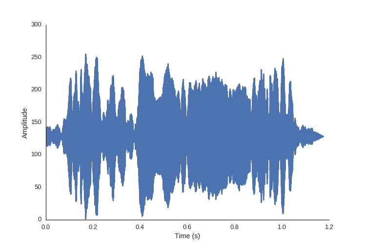

<!--
-->

Sound waves are air pressure varying with time

<!--
-->

Light intensity (wavelength) varying with space (on our retina) is how we see

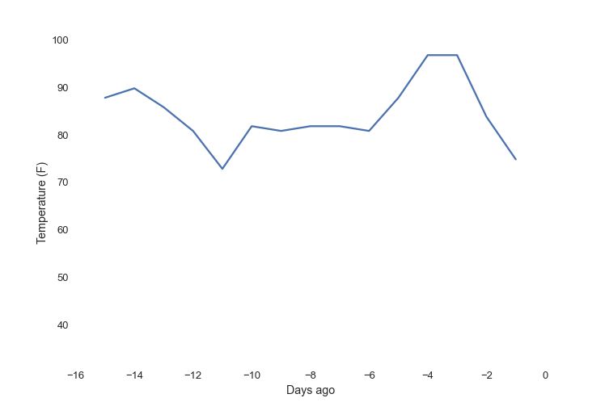

<!--
-->

Temperature varying with time

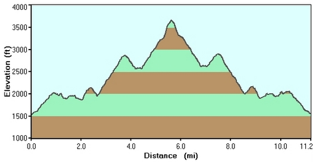

<!--
-->

Elevation on a hiking trail varies with distance from the trailhead.

How do we get a digital signal?
-------------------------------

A digital signal is a signal turned into discrete values at discrete points in time or space

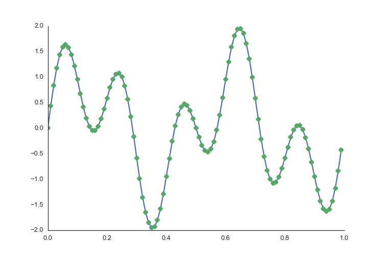

To get a digital signal we need to turn the continuous signal into a series of points so we can hold the signal in computer memory. When we do this for the x-axis it's called sampling.

Sampling records the value of the signal at a (usually) constant interval.

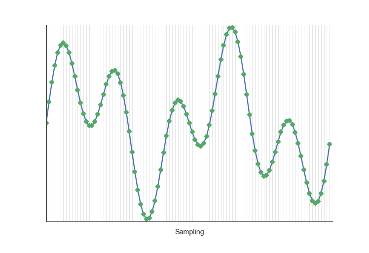

Quantization buckets values on the y-axis. We take the value at the x-interval time point we established in sampling and round to the nearest precision we can achieve with the data type we are storing it in, be that an 8-bit integer or 64-bit float.

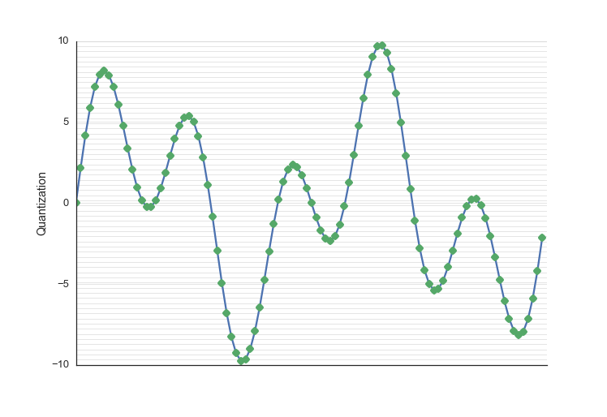

We need to have an appropriately high level of sampling frequency and quantization resolution to accurately capture the data we are trying to measure. Otherwise we may distort our signal in unintended ways.

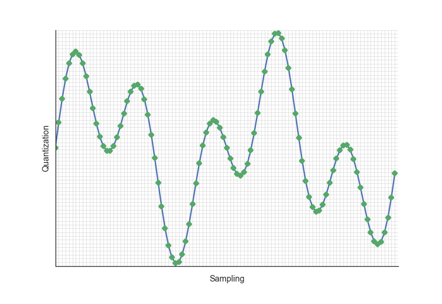

The above image shows the same signal with increasing quality of sampling rate and quantization resolution.

The sampling rate increases in the plots from left to right. Notice how we don't have an interpolation between the points, I didn't draw straight lines between the points, because when we take a snapshot measurement at each time point, it is the value until it is replaced by the next sample. If our sampling rate is too low, we will miss high frequency features in our data.

Quantization in the above grid increases from bottom to top. With a high quantization level, we can get closer to the real value of the underlying data. With a quantization level that is two low we may have many samples in a row that end up with the same value, even though these samples may have had important differences.

So now we have a digital signal. Any time we do anything to that signal, that's DSP.

We may use a piece of hardware called an [analog-to-digital converter](https://en.wikipedia.org/wiki/Analog-to-digital_converter) to do this work of transfering the signal from continuous to discrete for us.

It is important to have a good enough understanding of the underlying process
to know what will be adequate sampling and quantization.

The power of Superposition
--------------------------

In order to more easily understand and work with complex systems, we are going
to split them up into pieces that are easier to deal with. In order to guarantee
this is valid, we will limit ourselves to working with linear systems.

### What is a system?

A system is simply any time you have any input signal and you do something with it to end up with and output signal.

### What is a linear system?

A system is considered linear if it meets 3 properties1:

* Homogeneity: a change in the input signal's amplitude results in a corresponding change in the output signal's amplitude.
* Additivity: two (or more) signals added together before input is the same as output signals added together
* Shift invariance: a shift (in samples) of the input signal with result in and equal shift in the output signal

Most DSP techniques take advantage of the ability to divide linear systems into simplified parts. Luckily for us, most systems are linear. An example of a linear system is an electrical circuit, where a change is in the input voltage will result in a analogous change in the output voltage. An example of a non-linear system would if this system were to be over-driven to experience [clipping](https://en.wikipedia.org/wiki/Clipping_(signal_processing)). [More examples](http://classroom.synonym.com/real-life-functions-linear-equations-2608.html)

This is important because it allows us to decompose signals into simpler signals, process them individually, and add them back together. We call this superposition.

### The Impulse Response

If we have a single N point signal, we can break it down into a summation of N signals, with each signal being all zeros except for a single point which is a point from the original signal:

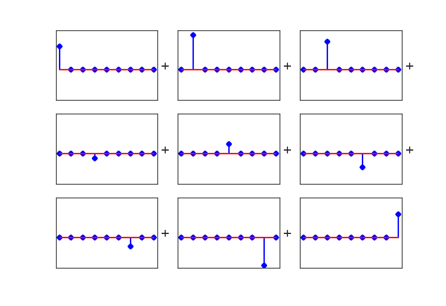

=

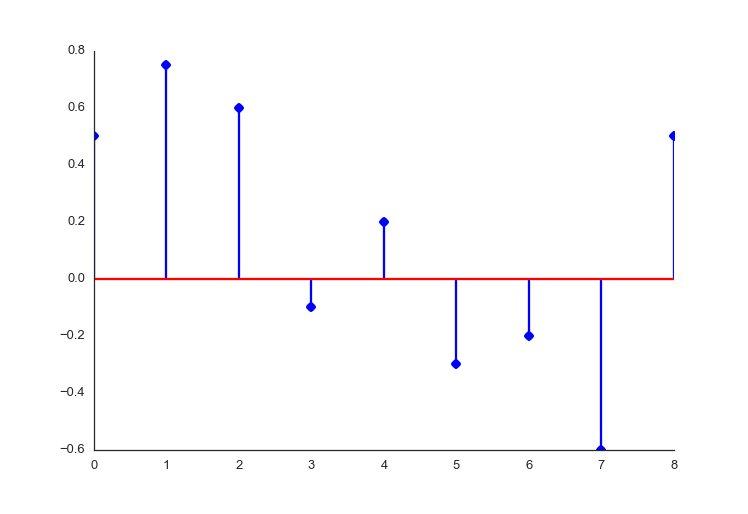

The delta signal is a special name for a signal which is 1 at point zero, and 0 everywhere else.

Now, notice how each of these component signals could be represented as a scaled and shifted version of the delta signal.

<!-- <example figure?> -->

So, because of superposition, we can conclude that if we know a systems response to the delta signal, we know the systems response to *any* signal. This output signal from the input delta signal is called the impulse response, and it will come in handy when we want to create filters.

### All signals are composed of sine waves

We have another useful way of representing a signal. Any signal2 can be represented as a weighted sum of sine waves.

Here is a signal that I've assembled myself, using Python:

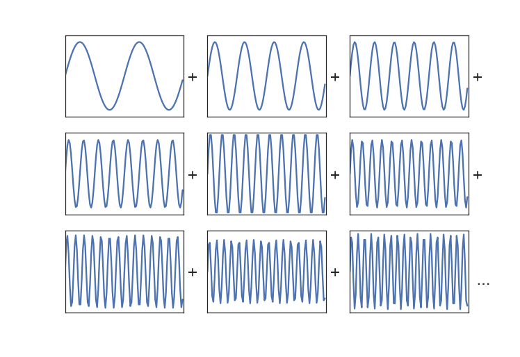

=

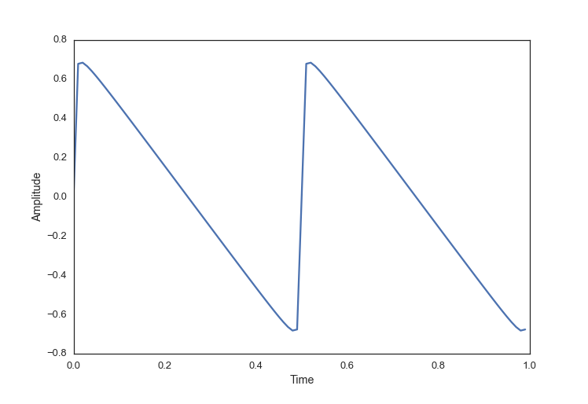


import numpy as np

t = np.arange(0.0, 1.0, 0.01)
signal = np.zeros_like(t)
for i in range(2, 100, 2):
    signal = np.sin(i*2*t*np.pi)/i


In order to find the relative waiting of the sine wave components that make up a signal, we can do a Fourier transform. Specifically, we can do the DFT (Discrete Fourier Transform), or the faster (although conceptually more complex) algorithm the FFT (Fast Fourier Transform). The details of these algorithms would span multiple blog posts on their own, and while it is very interesting, we're just going to skip right to using the implementations that smart people have already provided for us.

So, what you need to know at this point, is that the FFT takes a time domain signal and gives us back those relative weightings of sine wave components. We now call this the signal in the frequency domain.

Lets take the simple signal I made above, and run it through an FFT function:


import matplotlib.pyplot as plt

spectrum = np.fft.rfft(sumplot)
freqs = np.fft.rfftfreq(len(sumplot), 1./(len(sumplot)))

plt.plot(freqs, abs(spectrum))


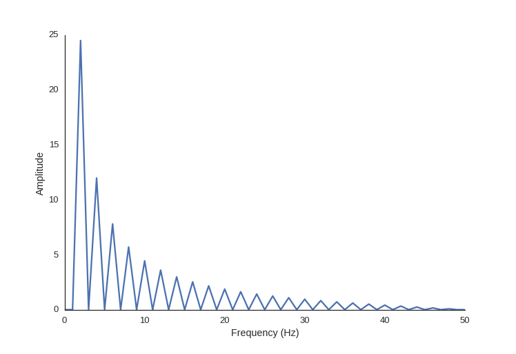

So we can see here that there is zero amplitude at the odd frequencies and decreasing power with the higher multiples of two, as we would expect.

To see these concepts in action, you can read my posts about [creating a digital filter](../Calibrating-Ultrasonic-Speakers), and stay tuned for future posts for basic examples of using DSP with audio, images and data compression.

**Footnotes**

1 Strictly only two, additivity and homogeneity, but shift-invariance is
necessary is a lot of DSP techniques too, so I'm including it. Technically, this is called a linear time-invariant system (LTI)

2 Well, almost any signal. Signals with Corners such as a square waves cannot strictly be formed from a summation of sine waves. However, we can get *really* close. So close that the difference between the two has zero energy. See the <a href='https://en.wikipedia.org/wiki/Gibbs_phenomenon'>Gibbs phenomena</a>

