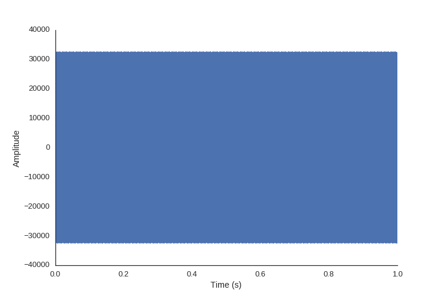
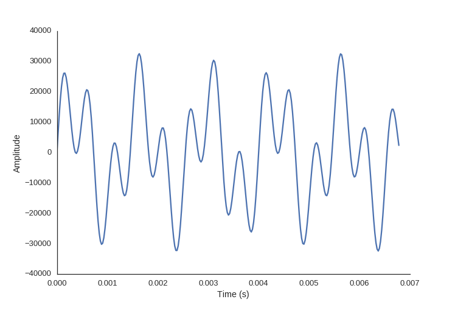
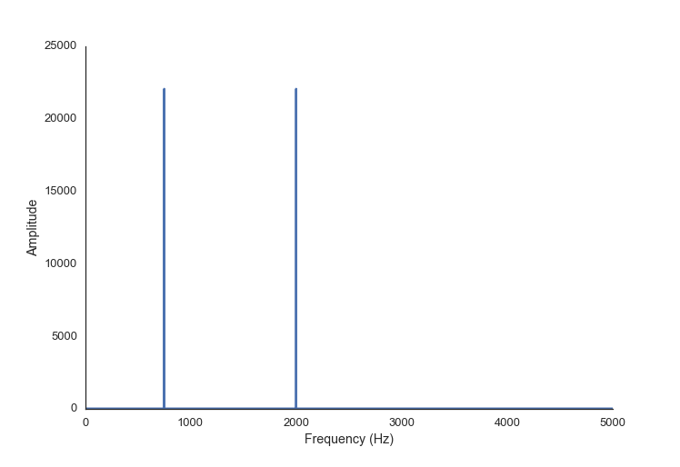
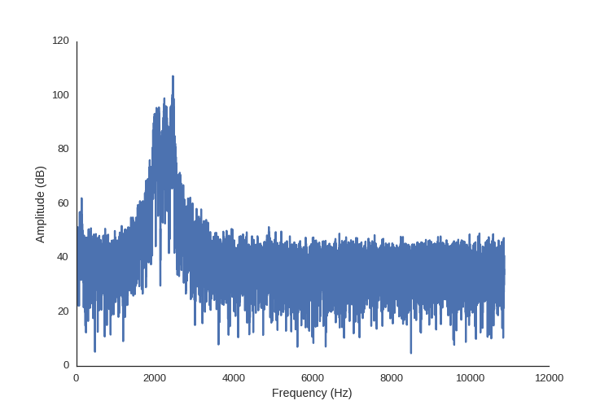
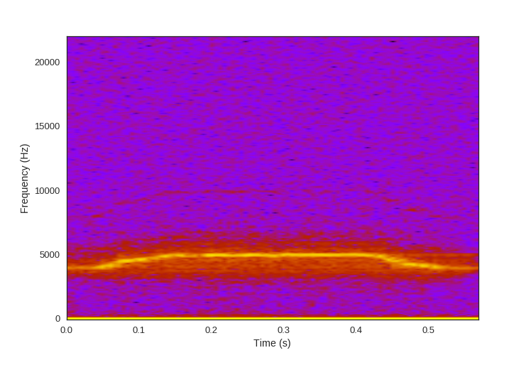
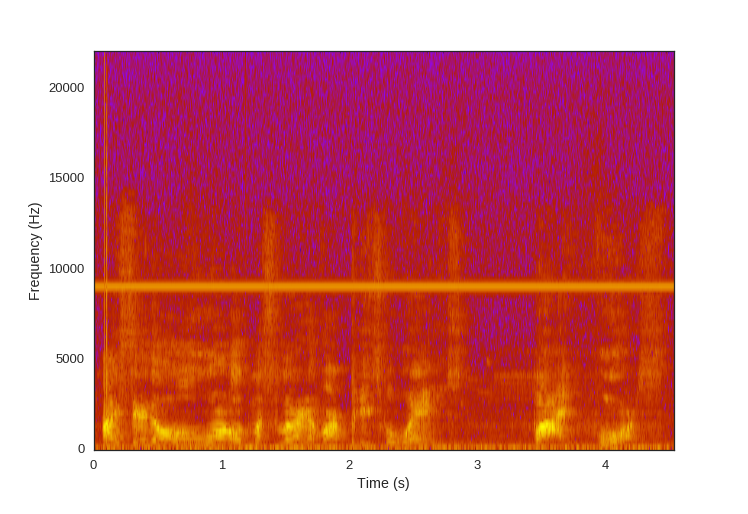
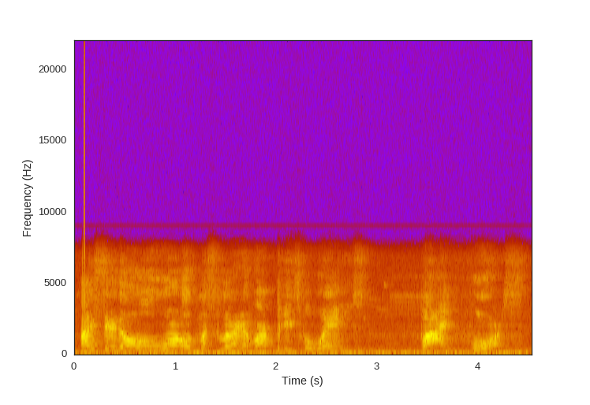
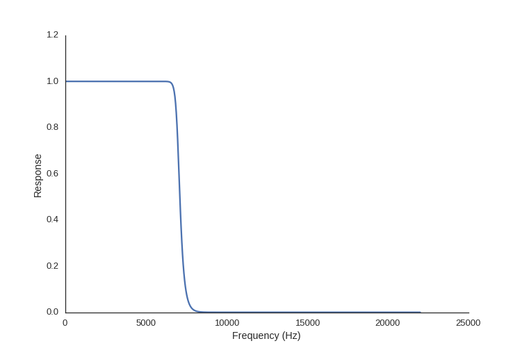
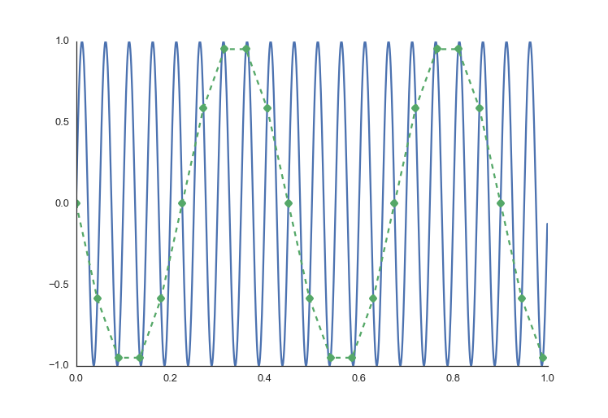
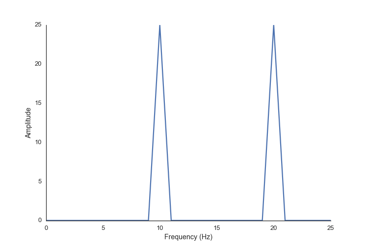

Digital Signal Processing for Audio Signals
==============

This post builds on the previous one on [DSP Fundamentals](../DSP-fundamentals). In this post I am going to give an introduction to how you can use Digital Signal processing (DSP) to analyze and manipulate audio files. As a disclaimer, this post is going to move a little faster, and some of the links in this post will link to extra material that is more advanced, and may assume more background knowledge than I've included thus far1.

What is Sound?
--------------

Sound is changes in air pressure. Human ears are biological transducers that turn these air pressure changes into electrical signals in our brain, which we perceive as sound. Similarly, a mechanical transducer can turn the same air pressure changes into an electrical signal stored as a sound recording on digital hardware.

Here is an example of what that looks like:

Even if you zoom in, so you can see the shape of the signal, it's still hard to tell what sound this is:

And here is what it sounds like:

<audio src="../audio/twotone.wav" controls></audio>

The reason the signal doesn't look like much is because this signal is in the time domain. For humans, [we perceive sound in the frequency domain](https://www.youtube.com/watch?v=0NJ_EAQjR3c). 

Time domain vs frequency domain
--------------------------------

So let's transform the sound to reveal the frequency information (using the FFT, as discussed in my [last post](../DSP-fundamentals/#all-signals-are-composed-of-sine-waves)):


import numpy as np
import matplotlib.pyplot as plt

# construct the signal
fs = 44100
step_size = 1./44100
t = np.arange(0.0, 1.0, step_size)
twotone = np.sin(t*750*2*np.pi) + \
		   np.sin(t*1500*2*np.pi)

# transform to frequency domain
spectrum = np.fft.rfft(twotone)
freqs = np.fft.rfftfreq(len(twotone), 1./fs)

plt.plot(freqs, abs(spectrum))


Now we can easily see that this is a sound with two tones of equal intensity in it.

You'll notice that the FFT function I'm using in the code snippets is called `rfft`. The r stands for "real" because the expected input signal contains only real numbers; the "regular" FFT algorithm accepts an input signal composed of complex numbers. As you might imagine, there is also a `fft` function in the SciPy signal library for this type of input. However, since we are only going to be working with signals from the physical world here, we are going to stick to the "real FFT". This will simplify things for us a bit.

An N point input signal will yield (N/2) + 1 point output signal which represents the weightings of the frequency components, from 0 to N/2 Hz. Specifically, the `rfft` will output a signal composed of complex numbers, the real component of which represents the amplitude of the cosine waves, and the imaginary component representing the amplitude of the sine waves.

Another way to think about it is: the overall amplitude of each frequency component is encoded as the magnitude of the complex number ($$\sqrt{real^2+imag^2}$$) and the phase is encoded as the angle ($$\tan^{-1}(imag,real)$$). To get the magnitude of a complex number `x` you can call the built-in function `abs` on it, like I did above. This is equivalent to `np.sqrt(x.real**2 + x.imag**2)`. To get the angle we can call `np.angle(x)`, which is equivalent to calling `np.arctan2(x.imag, x.real)`.

Let's look at a more interesting sound, first in the time domain again:

In the chart below is this sound in the frequency domain, the above signal run through the FFT code from above. This time I've changed the scale of the amplitude into [decibels](http://www.animations.physics.unsw.edu.au/jw/dB.htm), since this makes more sense when we are talking about sound.

However, this doesn't paint the whole picture, because in this sound clip the frequencies don't all occur at the same time.

We can combine the frequency and time information together with a visualization called a spectrogram. This technique takes chunks of the time domain signal, and applies the fft to them. We place these chunks next to each other and use color to signify amplitude.

There is a time-frequency resolution trade off that occurs with the size and overlap of the chunks we choose.


from scipy.io import wavfile

fs, mysound = wavfile.read('sound.wav')
plt.specgram(mysound, Fs=fs, NFFT=512, noverlap=256, cmap='gnuplot')


Now you might be able to imagine what this sounds like. Here is the audio clip, how close was your guess based on the spectrogram?

<audio src="../audio/whistle.wav" controls></audio>

Filtering
----------

Let's look at an example of speech:

 

<audio src="../audio/distorted_bender.wav" controls></audio>

You'll notice that this speech sample has an unpleasant high-pitched distortion in it. We're going to remove that using a digital filter. The [scipy signal module](http://docs.scipy.org/doc/scipy/reference/signal.html) provides us with the tools to build many different types of digital filters.

Conveniently, the distortion we want to filter out is all in the high frequency region of the audio clip, above all the frequencies of which we want to preserve. For this, we are going to use a low-pass filter - a filter which allows the lower frequencies to *pass through* the filter unaffected (and thus attenuates the high frequencies above a cutoff point). Digital [Infinite Impluse Response (IIR) filters](http://docs.scipy.org/doc/scipy-0.16.1/reference/signal.html#matlab-style-iir-filter-design), which are implementations based off of their analog filter equivalents, [are good for this sort](https://www.youtube.com/watch?v=9yNQBWKRSs4) of blanket attenuation of a range of frequencies, so that's what we're going to use.

The important characteristic of the filter for us to look at here is the frequency response of the filter. The frequency response describes how the filter will attenuate frequencies in the signal it's applied to. Different types filter have different shapes of frequency response. We're going to use a Butterworth filter because it has a flat response in the passband, but we would could use other canned filters SciPy has to offer.

To build our filter, we need to establish what we want the *passband* and *stopband* to be. The passband is the the range of frequencies which we want to preserve, and the stopband is the range of frequencies which we want to attenuate. So, looking at our signal we are going to set the passband to everything below 7kHz, and the stopband to everything above 8kHz. The frequencies between the stopband and the passband are the transition band, or roll-off.

We also need to figure out the *order* of the filter. The order of a digital filter is the number of previous input points in the signal used to calculate the current output. It will determine the number of coefficients in our filter. A higher order filter can give you a steeper transition between the passband and the stopband, but can add complexity (and thus processing time and resources).

Luckily for us, SciPy provides helper functions to help us pick the order, and also to normalize the cutoff frequencies with the sampling rate.


from scipy.io import wavfile
from scipy import signal

fs, audio = wavfile.read('audio/distorted.wav')

passband = 7000. #Hz
stopband= 8000.
# nyquist frequency discussed later, basically we need to normalize
# the input frequencies to the samplerate
nyq = 0.5 * fs

# build the filter
order, normalized_cutoff = signal.buttord(passband/nyq, stopband/nyq, 3, 40)
b, a = signal.butter(order, normalized_cutoff, btype='low')

# create a new array to hold our filtered signal
low_passed = np.zeros_like(audio)

# This is a sterio recording, so apply filter to both channels
low_passed[:,0] = signal.lfilter(b, a, audio[:,0])
low_passed[:,1] = signal.lfilter(b, a, audio[:,1])


 

<audio src="../audio/filtered_bender.wav" controls></audio>

We can use our filter coefficients as inputs to another SciPy helper function, [`freqz`](http://docs.scipy.org/doc/scipy-0.16.1/reference/generated/scipy.signal.freqz.html),  to see the resultant frequency response of our filter:


w, h = sg.freqz(b, a)

plot((w/np.pi)*nyq, abs(h))


 

Lastly, I want to talk about sampling rate. If you are recording audio, it is necessary to pick a sampling rate that's at least twice the frequency of the highest frequency of the sounds you wish to capture. Otherwise, you will experience aliasing, which is where the high frequency components appear in the recording as low frequency sounds. 

To illustrate this, imagine in the image below that the blue signal represents the real sound, and the green dots are where you record samples. Here, the sampling rate is too low and you end up with an audio recording that sounds like it has a different tone in it than the real one. To show this, I've drawn the green dotted line. We need *at least* twice the highest frequency so that we can get two sample points per period. This rate is referred to as the [Nyquist rate](https://www.youtube.com/watch?v=Fy9dJgGCWZI)

Here is a code example of aliasing. You can see that we declare two signals to have a frequency of 110 and 120 Hz each, but our sampling rate (or generation rate in this case) is too low, and when we do an FFT analysis it looks like there are the frequencies of 10 and 20 present.


fs = 500
step_size = 1./fs
t = np.arange(0.0, 1.0, step_size)
freq0 = 120
freq1 = 110
twotone = np.sin(t*freq0*2*np.pi) + \
		  np.sin(t*freq1*2*np.pi)

spectrum = np.fft.rfft(twotone)
freqs = np.fft.rfftfreq(len(twotone), 1./fs)

ax, fig = plot(freqs, abs(spectrum), 'Frequency (Hz)', 'Amplitude')


This is just scraping the surface of what you can do with DSP and audio. I hope this gives you an idea of how it can be used and where to start to learn more.

Here are a few extra resources that I've found useful:

* DSP Guide: [filter basics](http://www.dspguide.com/ch14/1.htm), [IIR Filters](http://www.dspguide.com/ch19.htm), [Butterworth vs Chebyshev](http://www.dspguide.com/ch20/1.htm), [Audio Processing](http://www.dspguide.com/ch22.htm) (I seriously love this book)
* [All about IIR filters](http://www.mikroe.com/chapters/view/73/chapter-3-iir-filters/)
* [Intro to FIR filter](https://www.youtube.com/watch?v=NvRKtdrssFA)

 

1 However, the linked materials I've found to be *much* more understandable for someone without an advanced math degree, which frequently seems to be the barrier for entry for "intro" materials about DSP on the internet. 
