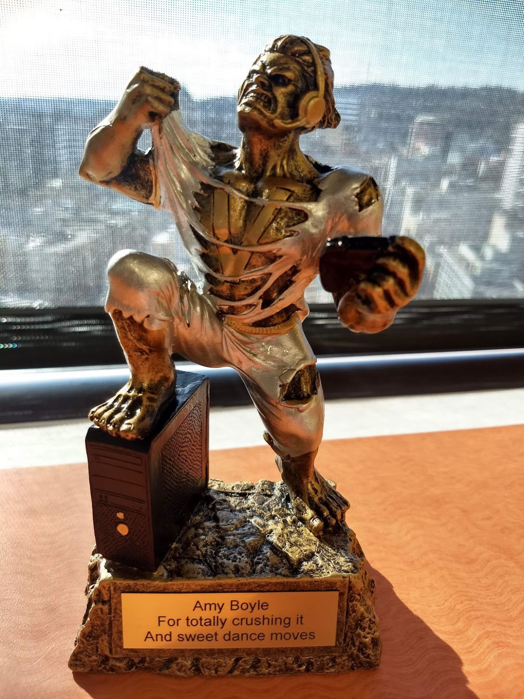

About Me
========

My name is Amy Boyle, and I do software development for fun and profit. My current work is writing code for software analytics. I started my career with several years of software developent for neroscience research. My main languages are Java and Python. I like to occasionally write about things I once thought was hard (or still do), and give conference talks in the times it is safe to do so in person.

  

