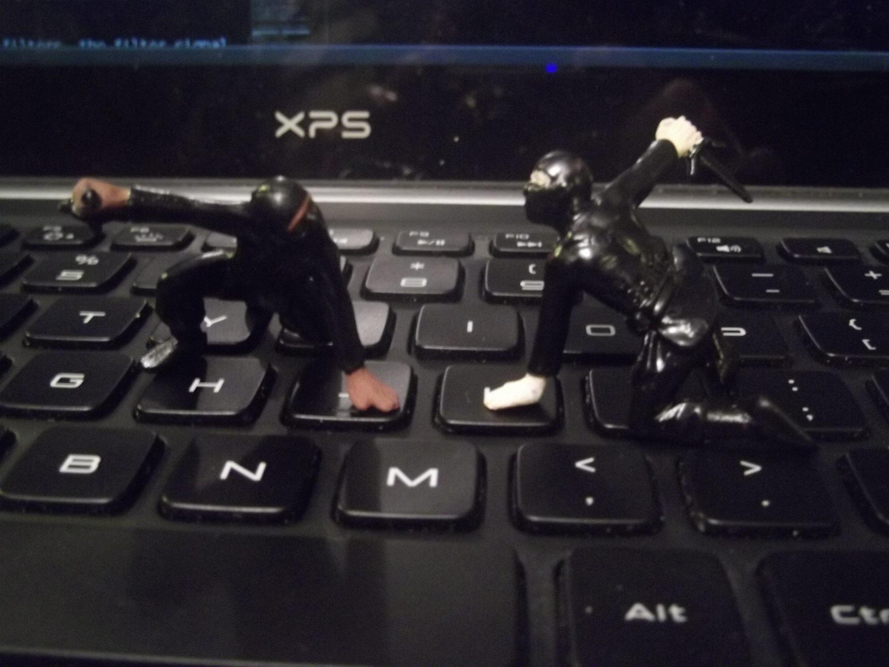

About Me
========

Hello Interwebbers!

My name is Amy Boyle, and I do software development for fun and profit. My current work is writing code for auditory neuroscience research. I am using mostly Python these days, but have experience in, and dable in other languages which may feature here sometime.

You can find me on [github](https://github.com/boylea) and [twitter](https://twitter.com/amylouboyle)

What's with the Ninjas?
-----------------------

In the software development world, a very common, and very useful technique, of problem solving is [rubber ducking](http://en.wikipedia.org/wiki/Rubber_duck_debugging). Well, my duck is a bunch of ninjas in this case. This site is basically a public place for me to talk to my ninjas. Sometimes it will be problems I solved, other times just other stuff I think is worth sharing. Futhermore, don't they say that the best way to learn is to teach? Anyways, it gives me an excuse to play with toy ninjas and take pictures of it.

